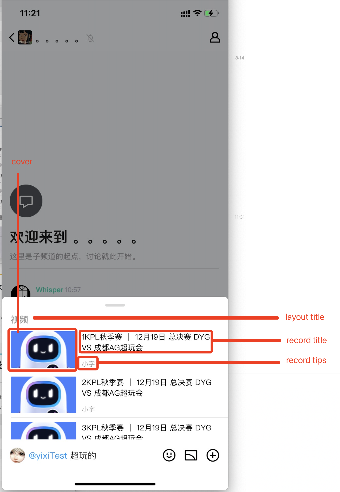
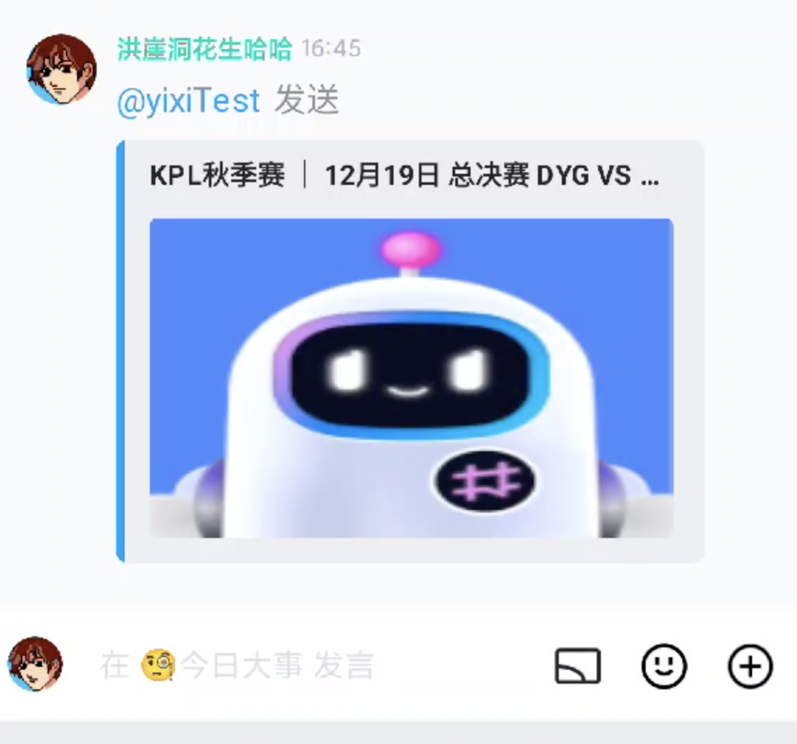

# 内联搜索

### 功能描述

- 机器人配置了回调接口(开发者提供回调地址和机器人botAppID，联系平台运营人员进行配置)。
- 机器人开启内联搜索功能开关(请联系平台运营人员，由平台方进行配置)
- 用户在频道中 @机器人 输入内容时会发起请求, 开发者响应相应的数据以展示在用户端

### 效果展示

开发者返回数据后将在频道输入框上方展示:

点击其中一个记录后将在聊天窗口发送一条 ARK:

### 开发者提供回调示例

`https://www.thirdsite.com/xxx`

### 请求方式

`POST`

### Content-Type

`application/json`

### 请求数据

[Interaction](./model.md#Interaction)对象，其中

`Interaction.type = 2` 对应 `InteractionType` 中的 `APPLICATION_COMMAND`

`Interaction.data.type = 9` 对应 `InteractionDataType` 中的 `CHAT_INPUT_SEARCH`

#### Interaction.data.resolved 参数 [InteractionData.resolved](./model.md#InteractionData)

| 字段名       | 类型              | 描述           |
| ------------ | ----------------- | ---------------|
| keyword      | string            | 关键词         |

### 第三方需要返回的数据

返回的 `Content-Type` 目前只支持 `application/json`

| 字段名       | 类型              | 描述           |
| ------------ | ----------------- | ---------------|
| layouts      | [Layout](#Layout) array      | 布局数据数组   |

#### Layout

| 字段名       | 类型              | 描述           |
| ------------ | ----------------- | ---------------|
| layout_type  | uint32            | [LayoutType](#LayoutType) 布局类型 |
| action_type  | uint32            | [ActionType](#ActionType) 点击操作动作类型|
| title        | string            | 布局块标题 |
| records      | [Record](#Record) | 布局内数据数组 |

#### LayoutType 布局类型

| 值       | 描述           |
| ------------ | -----------------    |
| 0            | 左图右文字布局 |

#### ActionType 点击操作动作类型

| 值       | 描述           |
| ------------ | -----------------    |
| 0            | 点击数据发送 ARK |

#### Record

| 字段名       | 类型              | 描述           |
| ------------ | ----------------- | ---------------|
| cover        | string            | 封面 URL, 必须是白名单中 URL|
| title        | string            | 数据块文字 |
| tips         | string            | 数据块文字下方小字 |
| url          | string            | 数据块点击后操作的 URL, 必须是白名单中 URL|
