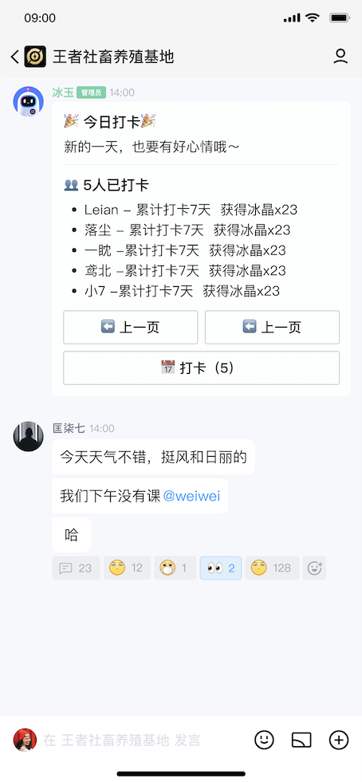

# 发送带有按钮的消息

## 效果



## 功能描述

通过在 `MessageToCreate` 中指定 `keyboard` 字段发送带按钮的消息，支持 `keyboard 模版` 和 `自定义 keyboard` 两种请求格式。

- 要求操作人在该子频道具有`发送消息`和 对应`消息按钮组件` 的权限。
- 请求参数 `keyboard 模版` 和 `自定义 keyboard` 只能单一传值。
- `keyboard 模版`
  - 调用前需要先申请消息按钮组件模板，这一步会得到一个模板 id，在请求时填在 `keyboard` 字段上。
  - 申请消息按钮组件模板需要提供响应的 json，具体格式参考 [InlineKeyboard](../model/inline_keyboard.md#InlineKeyboard)。
- 仅 markdown 消息支持消息按钮。

## 使用示例

### 1：使用 keyboard 模版

```ts
async function demo() {
  let { data } = await client.messageApi.postMessage(channelID, {
    markdown: {
      template_id: 1,
      params: [
        {
          key: 'title',
          value: ['标题'],
        },
      ],
    },
    msg_id: 'xxxxxx',
    keyboard: {
      id: '123',
    },
  });
}
```

### 2：使用自定义 keyboard

```ts
async function demo() {
  let { data } = await client.messageApi.postMessage(channelID, {
    markdown: {
      template_id: 1,
      params: [
        {
          key: 'title',
          value: ['标题'],
        },
      ],
    },
    msg_id: 'xxxxxx',
    keyboard: {
      content: {
        rows: [
          {
            buttons: [
              {
                id: '1',
                render_data: {
                  label: 'AtBot-按钮1',
                  visited_label: '点击后按钮1上文字',
                },
                action: {
                  type: 2,
                  permission: {
                    type: 2,
                    specify_role_ids: ['1', '2', '3'],
                  },
                  click_limit: 10,
                  unsupport_tips: '编辑-兼容文本',
                  data: '/搜索',
                  at_bot_show_channel_list: true,
                },
              },
            ],
          },
        ],
        bot_appid: 123123123,
      },
    },
  });
}
```


## 返回说明

成功返回 [Message](../model/message.md#message) 对象
